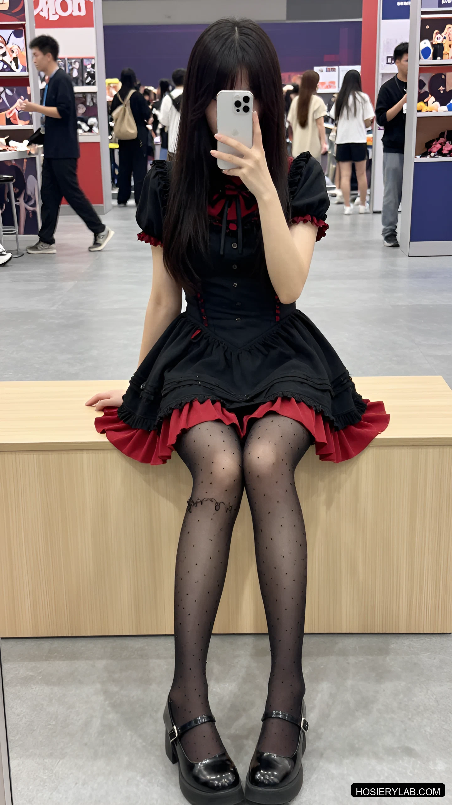

<div align="center">

# HOSIERY<span>LAB</span>

**Every pair, under the same light.**

一个面向设计师、造型师与 AI 角色创作者的丝袜视觉参考与提示词分类系统。

[在线目录](https://hosierylab.com/hosiery) · [使用方法](https://hosierylab.com/guide) · [隐私政策](https://hosierylab.com/privacy)

</div>

<br />

## 项目简介

HosieryLab 把丝袜拆成可观察、可检索、可复用的变量：D 数、透明度、颜色、覆盖范围、袜型、织法、光泽、图案、脚尖、脚跟与袜口结构。每条记录都可以作为视觉参考，也可以复制成单独的丝袜提示词层。

通用的“黑丝”标签往往不足以复现画面；5D 与 40D、哑光与缎光、连裤袜与吊带袜会直接改变生成结果。这个项目为这些差异建立统一词汇和浏览方式。

## 公开内容

| 内容 | 入口 |
| --- | --- |
| 在线丝袜目录 | [hosierylab.com/hosiery](https://hosierylab.com/hosiery) |
| 提示词使用指南 | [PROMPT-GUIDE.md](PROMPT-GUIDE.md) |
| 丝袜分类词典 | [TAXONOMY.md](TAXONOMY.md) |
| 方法与来源 | [在线页面](https://hosierylab.com/about/sources) |
| 使用条款 | [在线页面](https://hosierylab.com/terms) |

## 主要功能

- 按长度、透明度、颜色、D 数、织法、光泽和图案筛选
- 详情页拆分完整提示词与丝袜提示词
- 统一的中英文页面入口
- 结构化记录与可复用的提示词分类
- 生成图片与私有提示词归档分离存储

## 精选视觉样本

从公开目录挑选的少量样本，用来展示分类维度与统一光线。完整目录请前往[在线丝袜库](https://hosierylab.com/hosiery)。

<table>
  <tr>
    <td align="center"><a href="https://hosierylab.com/hosiery/hl-a000001"></a><br /><sub>15D · 纯黑 · 连裤袜</sub></td>
    <td align="center"><a href="https://hosierylab.com/hosiery/hl-a000003"></a><br /><sub>20D · 波点 · 纯黑</sub></td>
    <td align="center"><a href="https://hosierylab.com/hosiery/hl-a000008"></a><br /><sub>20D · 后缝线 · 炭灰</sub></td>
  </tr>
  <tr>
    <td align="center"><a href="https://hosierylab.com/hosiery/hl-a000010"></a><br /><sub>15D · 缎光 · 炭灰</sub></td>
    <td align="center"><a href="https://hosierylab.com/hosiery/hl-a000015"></a><br /><sub>40D · 罗纹 · 黑色</sub></td>
    <td align="center"><a href="https://hosierylab.com/hosiery/hl-a000020"></a><br /><sub>薄透 · 结构 · 统一光线</sub></td>
  </tr>
</table>

> 精选图是合成视觉参考；图片与对应记录以官网目录为准。

## 本地运行

```bash
npm install
npm run dev
```

打开 <http://localhost:3000>。

## 仓库范围

仓库包含网站源码、分类词典、界面和非敏感目录索引。生成图片、私有提示词归档和运行凭证不放入 GitHub。

## 联系方式

- X：[@minaoneday](https://x.com/minaoneday)
- Email：[hosierylab@agentmail.to](mailto:hosierylab@agentmail.to)
- GitHub：[aurora-ai-lab/hosierylab](https://github.com/aurora-ai-lab/hosierylab)

## License

详见 [LICENSE](LICENSE)。
